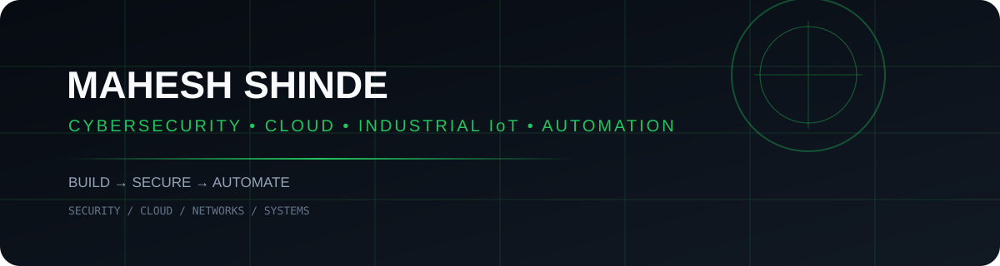

<div align="center">



# **MAHESH SHINDE**

### `Cybersecurity  •  Cloud Security  •  Industrial IoT  •  Automation`

**Building secure systems, cloud infrastructure, and automation solutions.**

</div>

---

## `01` // SYSTEM STATUS

| AREA | STATUS | FOCUS |
|---|---|---|
| 🛡️ Cybersecurity | `ACTIVE` | Offensive · Defensive · SIEM · Forensics |
| ☁️ Cloud Security | `ACTIVE` | AWS · IAM · EC2 · S3 · VPC |
| 📡 Industrial IoT | `ACTIVE` | Arduino · Raspberry Pi · MQTT · MySQL |
| ⚙️ Automation | `BUILDING` | Python · APIs · n8n · Workflows |

---

## `02` // TECH ARSENAL

```text
┌─ SECURITY ───────────────────────────────────────────────┐
│ Kali Linux   Nmap   Wireshark   Burp Suite   Wazuh      │
│ Splunk       ELK    OSINT       Forensics               │
└─────────────────────────────────────────────────────────┘

┌─ CLOUD ──────────────────────────────────────────────────┐
│ AWS EC2   S3   IAM   RDS   VPC   AWS CLI                │
└─────────────────────────────────────────────────────────┘

┌─ SYSTEMS / IoT ──────────────────────────────────────────┐
│ Python   Java   C/C++   Arduino   Raspberry Pi          │
│ MQTT     MySQL   Linux   Git   Networking               │
└─────────────────────────────────────────────────────────┘

┌─ AUTOMATION ─────────────────────────────────────────────┐
│ n8n   Python Automation   APIs   Workflow Automation     │
└─────────────────────────────────────────────────────────┘
```

---

## `03` // PROJECT DIRECTORY

> **Architecture first. Code follows.** These directories are reserved for documented project builds; source code is not being added to the profile yet.

### 🛡️ BLACKWALL
**Unified IDS / IPS / SIEM for Industrial IoT**

`projects/project-blackwall/`

`Arduino → Python Middleware → Raspberry Pi → MySQL → SIEM → Response`

### 🧪 CYBERSECURITY HOME LAB
**Security monitoring, detection and offensive-security environment**

`projects/cybersecurity-home-lab/`

### 📱 PHANTOMX
**Android security application**

`projects/phantomx/`

### 📦 SUCHI
**Smart accounting & inventory system**

`projects/suchi/`

---

## `04` // EXPERIENCE

**Cybersecurity Intern — Cyber Crime Police Station, Nagpur**  
Digital evidence, phishing cases, online fraud incidents, OSINT and cybercrime investigation workflows.

**Cloud Computing Intern — Revat Network**  
AWS EC2, S3, IAM, RDS, VPC and cloud-security practices.

**Head of Department — DIPEX Steering Committee**  
Technical coordination, project planning, team leadership and event execution.

---

## `05` // CERTIFICATIONS

`Tata Cybersecurity Analyst` · `Deloitte Cyber Job Simulation` · `Advanced Java`  
`CEH — Certified Ethical Hacker` · `OCI Generative AI Professional`

---

## `06` // CURRENT OPERATIONS

```text
[████████████████████] CYBERSECURITY
[██████████████████░░] CLOUD SECURITY
[██████████████████░░] INDUSTRIAL IoT
[███████████████░░░░░] AI / BUSINESS AUTOMATION
```

---

<div align="center">

### **BUILD → SECURE → AUTOMATE**

[GitHub](https://github.com/MrShindeMahesh)  •  **Mahesh Shinde**

</div>
